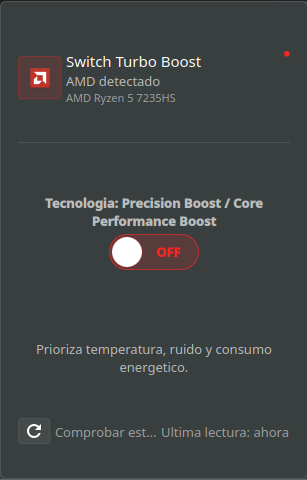
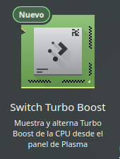
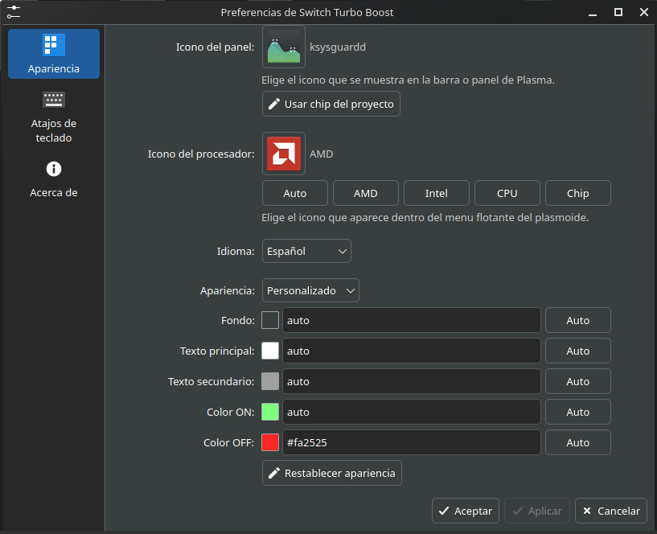
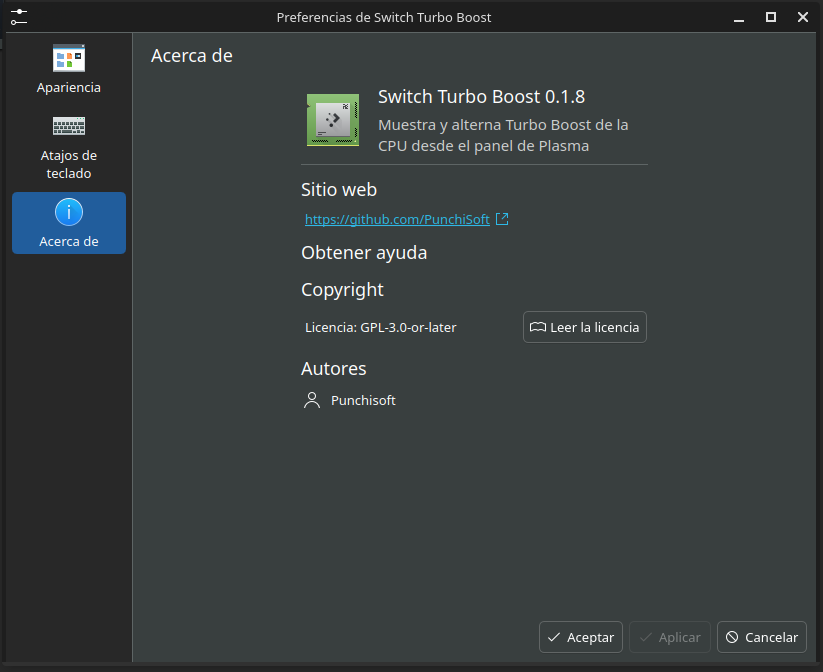
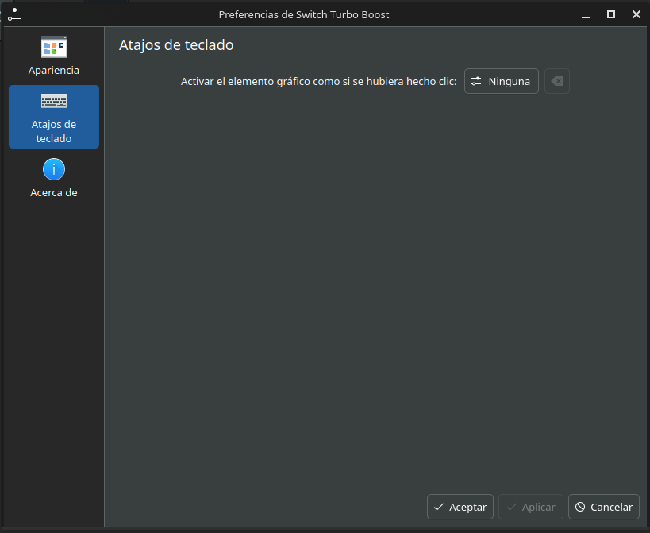

<!--
SPDX-FileCopyrightText: 2026 Punchisoft
SPDX-License-Identifier: GPL-3.0-or-later
-->

# Switch Turbo Boost Plasmoid

Plasmoide liviano para el entorno de escritorio KDE Plasma 6. Muestra el estado de Turbo Boost en el panel y permite activarlo o desactivarlo con autenticacion de PolicyKit.

Este proyecto es complementario a Switch Turbo Monitor. No reemplaza ni reescribe la aplicacion principal; solo cubre el interruptor de Turbo Boost.

## Caracteristicas

- Interfaz QML para Plasma 6.
- Icono compacto en el panel.
- Menu flotante con estado, descripcion y control ON/OFF.
- Indicador verde cuando Turbo Boost esta ON.
- Indicador gris cuando Turbo Boost esta OFF.
- Iconos locales de procesador basados en Papirus Icon Theme.
- Texto AMD, Intel o CPU detectada segun el procesador.
- Nombre del modelo de CPU debajo del fabricante detectado cuando esta disponible.
- Lectura al cargar, despues de cambiar el estado y cada 15 segundos.
- Configuracion de icono del panel, icono del procesador automatico o personalizado, idioma y tamano del menu flotante.
- Apariencia automatica segun el tema de Plasma, con opcion de colores personalizados.
- Scripts externos Bash para consultar y modificar `/sys`.
- Script externo Bash para detectar fabricante de CPU desde `/proc/cpuinfo`.
- Cambios con `pkexec` y politica PolicyKit dedicada.
- No usa `sudo` dentro de QML.

## Compatibilidad

- Entorno de escritorio KDE Plasma 6.
- Sesion Plasma en Wayland o X11.
- Linux con PolicyKit y `pkexec`.
- CPU/kernel con alguno de estos controles:
  - `/sys/devices/system/cpu/cpufreq/boost`
  - `/sys/devices/system/cpu/intel_pstate/no_turbo`

## Capturas

| Menu flotante | Selector de widgets |
| --- | --- |
|  |  |

| Preferencias | Acerca de |
| --- | --- |
|  |  |

| Atajos de teclado |
| --- |
|  |

Las capturas del proyecto estan en `Images/`. No forman parte del paquete instalable del plasmoide; se incluyen para documentacion del repositorio.

## Estructura

```text
switch-turbo-boost-plasmoid/
├── package/metadata.json
├── package/contents/config/main.xml
├── package/contents/config/config.qml
├── package/contents/ui/main.qml
├── package/contents/ui/TurboSwitch.qml
├── package/contents/ui/config/ConfigGeneral.qml
├── package/contents/images/
│   ├── turbo-chip.svg
│   ├── vendor-amd.svg
│   ├── vendor-cpu.svg
│   └── vendor-intel.svg
├── Images/
│   ├── 00.png
│   ├── 01.png
│   ├── 02.png
│   ├── 03.png
│   └── 04.png
├── scripts/
│   ├── get-cpu-info.sh
│   ├── get-cpu-vendor.sh
│   ├── get-turbo-status.sh
│   ├── set-turbo-on.sh
│   └── set-turbo-off.sh
├── policykit/
│   └── org.punchisoft.switchturbo.policy
├── LICENSES/
│   └── GPL-3.0-or-later.txt
├── build-plasmoid.sh
├── install-plasmoid.sh
├── install-backend.sh
├── uninstall.sh
├── INSTALL.md
├── README.md
└── install.sh
```

## Instalacion

Para una guia paso a paso, consulte `INSTALL.md`.

### Scripts de instalacion

El proyecto separa la interfaz del plasmoide y los helpers del sistema:

| Script | Que hace | Cuando usarlo |
| --- | --- | --- |
| `install-plasmoid.sh` | Instala solo la interfaz QML en `~/.local/share/plasma/plasmoids/org.punchisoft.switchturbo/`. | Cuando se modifican archivos de `package/`, como QML, iconos, textos, idioma, configuracion o metadata. |
| `install-backend.sh` | Instala los scripts de `scripts/` en `/usr/local/libexec/switch-turbo-boost-plasmoid/` y la politica PolicyKit en `/usr/share/polkit-1/actions/org.punchisoft.switchturbo.policy`. | Cuando se modifican los helpers Bash o la politica PolicyKit. Requiere autenticacion mediante `pkexec`. |
| `install.sh` | Ejecuta `install-plasmoid.sh` y despues `install-backend.sh`. | Para una instalacion completa o para asegurarse de actualizar interfaz, backend y PolicyKit en una sola pasada. |
| `uninstall.sh` | Elimina el plasmoide local, los helpers del sistema y la politica PolicyKit. | Para desinstalar completamente el proyecto. |

### Descargar desde Git

```bash
git clone https://github.com/PunchiSoft/switch-turbo-boost-plasmoid.git
cd switch-turbo-boost-plasmoid
```

### Instalacion visual desde KDE Plasma

Esta opcion genera un archivo `.plasmoid` instalable desde la interfaz grafica de KDE Plasma:

```bash
chmod +x build-plasmoid.sh
./build-plasmoid.sh
```

Luego:

1. Abrir Plasma.
2. Agregar elementos graficos.
3. Instalar elemento grafico desde archivo local.
4. Seleccionar `switch-turbo-boost.plasmoid`.

El archivo `switch-turbo-boost.plasmoid` se genera desde el contenido de `package/`, por lo que `metadata.json` queda en la raiz del paquete y no se incluye la carpeta `package/` dentro del zip.

**Advertencia:** la instalacion visual solo instala la interfaz del plasmoid. Para que el boton ON/OFF funcione con permisos del sistema, ejecute tambien:

```bash
chmod +x install-backend.sh scripts/*.sh
./install-backend.sh
```

### Instalacion completa por script

Desde esta carpeta:

```bash
chmod +x install.sh install-plasmoid.sh install-backend.sh scripts/*.sh
./install.sh
```

El instalador copia el paquete QML en:

```text
~/.local/share/plasma/plasmoids/org.punchisoft.switchturbo/
```

Tambien instala, mediante `pkexec`, los helpers en:

```text
/usr/local/libexec/switch-turbo-boost-plasmoid/
```

y la politica PolicyKit en:

```text
/usr/share/polkit-1/actions/org.punchisoft.switchturbo.policy
```

Despues agregue **Switch Turbo Boost** al panel desde el selector de widgets de Plasma. Si no aparece inmediatamente, reinicie Plasma:

```bash
kquitapp6 plasmashell && kstart6 plasmashell
```

## Pruebas manuales

Consultar estado:

```bash
/usr/local/libexec/switch-turbo-boost-plasmoid/get-turbo-status.sh
```

Activar Turbo Boost:

```bash
pkexec /usr/local/libexec/switch-turbo-boost-plasmoid/set-turbo-on.sh
```

Desactivar Turbo Boost:

```bash
pkexec /usr/local/libexec/switch-turbo-boost-plasmoid/set-turbo-off.sh
```

## Seguridad

El QML no escribe directamente en `/sys` ni ejecuta `sudo`. Las acciones de cambio llaman a `pkexec` sobre scripts instalados en una ruta fija bajo `/usr/local/libexec`. PolicyKit limita la autorizacion a esos ejecutables concretos.

La lectura del estado no requiere privilegios. La escritura si requiere autenticacion administrativa porque modifica controles del kernel.

## Desinstalacion

```bash
chmod +x uninstall.sh
./uninstall.sh
```

Luego reinicie Plasma si el widget seguia cargado.

## Licencia

Copyright 2026 Punchisoft.

Distribuido bajo GPL-3.0-or-later. Consulte `LICENSES/GPL-3.0-or-later.txt`.

Los iconos de procesador en `package/contents/images/` estan basados en Papirus Icon Theme de Papirus Development Team:

- Fuente: https://github.com/PapirusDevelopmentTeam/papirus-icon-theme
- Licencia: GPL-3.0-only, consulte `LICENSES/GPL-3.0-only.txt` y los archivos `.license` junto a cada SVG.

## Advertencia

Cambiar Turbo Boost puede afectar rendimiento, consumo energetico, temperatura y ruido del equipo. Use este plasmoide solo si comprende el efecto esperado en su hardware.
